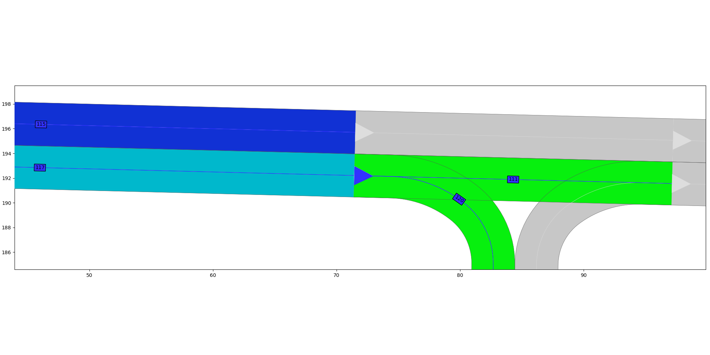

## About
Service to generate a global path from the current position to a target position. 

To solve the problem the commonroad search package is used. This packaged uses the map provided by the commonroad_map_provider.
The map contains a list of lanelets. Every lanelet represents one lane. The course of the lane is describes with points
that form a polyline.
Every lanelet can have none, one or more predecessor/successor lanelets and none or one left/right adjacent lanelets.
E.g. in the figure below you can see that the turquoise lanelet with id 117 has the lanelet with id 115 as left adjacent 
and no right adjacent. The successors of lanelet 117 are the green lanelets 111 and 120. This relationship exists in 
the other direction, too. Thus, the predecessor of lanelet 111 and the predecessor of lanelet 120 is lanelet 117. 

With this a model of the whole map can be created as a graph. The commonroad search packaged is used to search the shortest
path in this graph.




The node publishes the global path as points to /psag/ego_vehicle/global_path. It also publishes a GlobalPathLanelets message with
information about specific lanelets on the /psaf/ego_vehicle/global_path_lanelets topic. This message contains the lanelet ids
that are used by the ego vehicle if it follows the global path. Moreover, if a lanelet on the path has a adjacent those
lanelets are also included. All lanelets that are located in an intersection are published, too. 

## Topics
Subscribes to
```
Topic                                       Message Type
/carla/ego_vehicle/odometry                 nav_msgs/Odometry.msg
/psaf/world_info                            carla_msgs/CarlaWorldInfo.msg
/psaf/ego_vehicle/commonroad_map            std_msgs/String.msg
```

Publishes to
```
Topic                                       Message Type
/psaf/ego_vehicle/global_path              nav_msgs/Path.msg
/psaf/ego_vehicle/global_path_lanelets     custom_carla_msgs/GlobalPathLanelets.msg
```

## How to call the service from shell?
````shell
rosservice call update_global_path "{}"
````

## How to call the service from python code?
```python
import from custom_carla_msgs.srv import UpdateGlobalPath  # import service message type
rospy.wait_for_service('update_global_path')
update_global_path = rospy.ServiceProxy("update_local_path", UpdateGlobalPath)  # add service
update_global_path()  # call service with keyword argument
```

## Authors 
Julius Brandl
