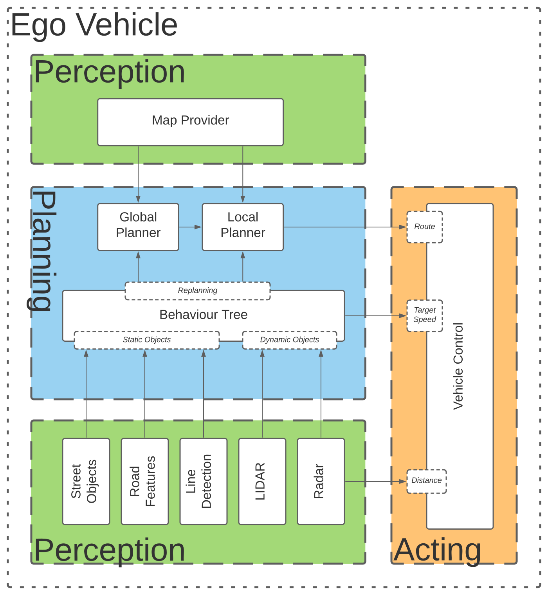
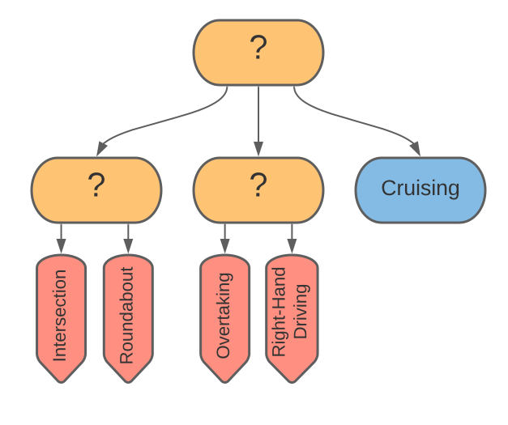

# Praktikum zur Simulation von autonomen Fahrzeugen - Gruppe 2
Author: Valentin Höpfner

The goal of this project was to develop an autonomous vehicle for the [CARLA-simulator](https://github.com/carla-simulator/carla). The task is to move collision-free and autonomously on various maps, on which other vehicles are also traveling, from an arbitrary starting point to an arbitrary destination. Two different modes are relevant for the evaluation: one mode in which traffic rules are observed, and one mode in which they are not. 

## Overview over the packages
We developed various ROS-nodes for the core-functionalities of our ego-vehicle. Each ROS-node is wrapped in a package, and those packages can be further grouped into one of three categories: _Perception_, _Planning_ and _Acting_. An overview over the packages and some of their interfaces is provided in the following graphic.



Another (somewhat less readable) way to visualize the nodes and their communication - with each other and with the ros-bridge - is a rosgraph:


## [Acting](Acting)

### [ego_vehicle](Acting/ego_vehicle)
This node is used to launch the ros bridge and all the other packages. It also contains the ```config.json``` file, that describes the sensor-array.

### [steering_controllers](Acting/steering_controllers)
This node computes a [CarlaEgoVehicleControl-Message](https://github.com/carla-simulator/ros-carla-msgs/blob/master/msg/CarlaEgoVehicleControl.msg) in each time step and publishes it to the _ros-bridge_. It uses a [Stanley-Controller](https://github.com/ll7/psaf2/wiki/Path-Tracking-Algorithmen) to follow the local path that is published by the local planner. The throttle command is computed through two _PID-Controllers_, one for distance and one for speed. This provides a primitive [ACC](https://en.wikipedia.org/wiki/Adaptive_cruise_control) that is also used to avoid collisions. 

## [Planning](Planning)

### [global_planner](Planning/global_planner)
This node computes a _global path_ from the position of the ego vehicle to a given finish position. 

### [local_planner](Planning/local_planner)
This node provides a service, that can be called on to compute a _local path_. You can pass parameters to switch lanes or get into the right lane for turning on an intersection.

### [behaviour_agent](Planning/behavior_agent)
This node contains the behaviour agent, that decides on the ego_vehicles actions (i.e. switching lane, overtaking) based on data from the _Perception_-nodes. It is based on a [behaviour tree](https://en.wikipedia.org/wiki/Behavior_tree_(artificial_intelligence,_robotics_and_control)). It can influence the vehicles actions, by calling the local_planner to compute new paths, or passing a different target-speed to the steering_controllers node. The following graphic represents the top level of the driving-behaviour-tree. You can find a detailed description of the behaviour-tree we use inside the [behaviour_agent-Package](Planning/behaviour_agent).



## [Perception](Perception)

### [commonroad_map_provider](Perception/commonroad_map_provider)
This node parses the _OpenDrive_-File and provides it in the right format to the local- and global-planners.

### [radar](Perception/radar)
This node computes the distance to the car driving in front using a radar sensor. Also considers the local path to filter the radar data. 

### [lidar](Perception/lidar)
This node computes the distance to other objects around the ego vehicle using a lidar sensor. It also considers lanelet-information to filter and group other traffic. 

### [street_object_detector](Perception/street_object_detector)
This node detects traffic signs and traffic lights using the semantic segmentation camera. It then uses OCR to detect speed limits and color information to determine the state of traffic lights.  

### [road_features](Perception/road_features)
This node computes informations about the current lanelet, like distance to the next intersection or the number of lanes. This information is provided to the behaviour agent. 


# Installation
Author: Julius Brandl

Install ROS Noetic: http://wiki.ros.org/noetic/Installation/Ubuntu

Install Carla 0.9.10: https://carla.readthedocs.io/en/0.9.10/start_quickstart/

Install Carla-Ros-Bridge (0.9.10.1): https://github.com/carla-simulator/ros-bridge

Clone our repo, install dependencies and build:
```shell script
cd ~/carla-ros-bridge
git clone https://github.com/ll7/psaf2.git
cd psaf2
./install_dependencies.sh
```
If you need more information about the installation process or if you don't trust our installation script check out our wiki entry:
https://github.com/ll7/psaf2/wiki/Installation

# Usage/Tips
Author: Valentin Höpfner

## How to launch the ego vehicle?
```shell
roslaunch ego_vehicle ego_vehicle.launch
```
## How to edit settings?
Just edit:
```shell
ego_vehicle ego_vehicle.launch
```
This could - for example - be the map or the ego_vehicle used. Description of the sensor array is also contained in the ego_vehicle package.
If you are looking for a place to put your launchfiles this is also the place.
## Setting target or spawn point
This is supposed to be done with the [PSAF20 - Competition Manager](https://github.com/ll7/psaf20/tree/main/psaf20_competition_manager). You can also respawn the ego vehicle from RVIZ. Note that respawning will trigger replanning the global plan as well as cancelling all the actions the ego_vehicle is currently taking.

